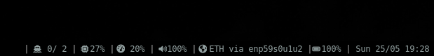

# My i3 config

**Screenshot :**  

**Bar :**  


## Keyboard configuration

Of course! Here's the full list of **keyboard shortcuts (keybindings)** from your i3 config, translated and organized in **English**:

---

### 🖥️ **Application Launching**

| Shortcut               | Action                                 |
| ---------------------- | -------------------------------------- |
| `$mod + Enter`         | Open terminal (`i3-sensible-terminal`) |
| `$mod + Shift + Enter` | Open Firefox                           |
| `$mod + n`             | Open Rofication GUI (not working)      |
| `$mod + Shift + n`     | Open Nautilus                          |
| `$mod + Space`         | Launch an app                          |
| `$mod + Shift + Space` | Launch a program                       |
| `$mod + r`             | Resize mode                            |
| `Print`                | Take screenshot with Flameshot         |

---

### 🔒 **Screen Locking**

| Shortcut                | Action                                                   |
| ----------------------- | -------------------------------------------------------- |
| `$mod + Escape`         | Lock screen with solid color (`i3lock`)                  |
| `$mod + Shift + Escape` | Lock screen with a blurred screenshot (`scrot + i3lock`) |

---

### ❌ **Window Management**

| Shortcut              | Action                                           |
| --------------------- | ------------------------------------------------ |
| `$mod + Shift + q`    | Close focused window                             |
| `$mod + Shift + f`    | Toggle floating mode                             |
| `$mod + Ctrl + Space` | Toggle focus between tiling and floating windows |
| `$mod + a`            | Focus parent container                           |
| `$mod + d`            | Focus child container                            |

---

### 🔁 **Window Focus**

| Shortcut                    | Action                  |
| --------------------------- | ----------------------- |
| `$mod + j`                  | Focus left              |
| `$mod + k`                  | Focus down              |
| `$mod + l`                  | Focus up                |
| `$mod + m`                  | Focus right             |
| `$mod + Arrow Keys` | Focus in that direction |

---

### 🔀 **Window Movement**

| Shortcut                    | Action                 |
| --------------------------- | ---------------------- |
| `$mod + Shift + j`          | Move window left       |
| `$mod + Shift + k`          | Move window down       |
| `$mod + Shift + l`          | Move window up         |
| `$mod + Shift + m`          | Move window right      |
| `$mod + Shift + Arrow Keys` | Move in that direction |

---

### 📐 **Window Layout**

| Shortcut   | Action                      |
| ---------- | --------------------------- |
| `$mod + h` | Split window horizontally   |
| `$mod + v` | Split window vertically     |
| `$mod + f` | Toggle fullscreen           |
| `$mod + s` | Set layout to stacked       |
| `$mod + w` | Set layout to tabbed        |
| `$mod + t` | Toggle split/unsplit layout |

---

### 🖥️ **Multi-monitor / Workspace**

| Shortcut                 | Action                                |
| ------------------------ | ------------------------------------- |
| `$mod + Alt + Left`      | Move workspace to left screen         |
| `$mod + Alt + Right`     | Move workspace to right screen        |
| `$mod + [1–9,0]`         | Switch to workspace 1–10              |
| `$mod + Shift + [1–9,0]` | Move focused window to workspace 1–10 |


---

### 🧰 **Scratchpad**

| Shortcut           | Action                            |
| ------------------ | --------------------------------- |
| `$mod + Shift + b` | Show scratchpad window            |
| `$mod + b`         | Move focused window to scratchpad |

---

### 🔄 **i3 Management**

| Shortcut           | Action                                  |
| ------------------ | --------------------------------------- |
| `$mod + Shift + c` | Reload i3 config                        |
| `$mod + Shift + r` | Restart i3 (in-place)                   |
| `$mod + Shift + s` | Run custom power menu (`power-menu.sh`) |


## Bar

📬 GitHub Notifications (github block)

    Purpose: Shows unread GitHub notifications.

    Token: Requires a GitHub token with notification access.

    Format: Displays the icon and total notifications.

    Behavior:

        Only shows if the total > 0.

        Warnings triggered for mentions or review requests.

🐳 Docker Containers (docker block)

    Purpose: Displays number of running Docker containers.

    Interval: Updates every 2 seconds.

    Format: Shows how many containers are running vs total (running/total).

🧠 Memory Usage (memory block)

    Purpose: Displays RAM and optionally swap usage.

    Format:

        Default: Shows RAM usage percentage.

        Alt format: Shows swap usage when toggled.

🖥️ CPU Load (cpu block)

    Purpose: Shows CPU usage.

    Thresholds:

        Info: 20%

        Warning: 50%

        Critical: 90%
        These thresholds change the block color accordingly.

🔊 Audio Volume (sound block)

    Purpose: Controls and displays sound volume.

    Click behavior:

        Left click (button = "left") opens pavucontrol (audio settings GUI).

🌐 Network (net block)

    Purpose: Displays network status (Wi-Fi or Ethernet).

    Format:

        Shows Wi-Fi signal strength, SSID, and frequency if on Wi-Fi.

        Shows ETH if connected via Ethernet.

        Displays network interface name (e.g., wlan0, eth0).

🔋 Battery (battery block)

    Purpose: Monitors battery status.

    Interval: Refreshes every 10 seconds.

    Format:

        Shows icon, battery percentage, and optionally time remaining.

        Displays full format even when charging.

🕒 Time & Date (time block)

    Purpose: Shows current date and time.

    Interval: Updates every 5 seconds.

    Format:

        Displays abbreviated weekday, day/month, and 24-hour time.

        Example: Sun 25/05 16:42

## Requirements

### 🧩 **Core environment**

* `i3-wm` – the window manager itself
* `i3status-rust` (aka `i3status-rs`) – for the status bar (`bar.toml`)
* `i3lock` – to lock the screen
* `feh` – to set your wallpaper
* `autorandr` – for automatic monitor detection and layout switching
* `xset` – to disable screen blanking and DPMS

---

### 🖼️ **Wallpaper**

* You are setting the wallpaper from: `~/.config/i3/wallpaper.jpg`

---

### 🔤 **Fonts**

* `ttf-dejavu` – for `DejaVu Sans Mono`
* `ttf-font-awesome` – for the `` icon and bar icons

---

### 🖱️ **Utilities**

* `scrot` – to take screenshots for the "transparent lock"
* `flameshot` – screenshot tool bound to `Print` key
* `brightnessctl` – to adjust screen brightness
* `playerctl` – to control media playback
* `pactl` – PulseAudio command-line tool for audio controls

---

### 🧰 **Launchers and menus**

* `dmenu` – lightweight app launcher
* `rofi` – required by `rofication-gui.py`
* `i3-dmenu-desktop` – script to launch `.desktop` applications

---

### 📦 **Apps**

* `firefox` – launched with `$mod+Shift+Return`
* `nautilus` – file manager
* `i3-sensible-terminal` – generic terminal launcher (usually points to `xterm`, `kitty`, etc.)

---

### 🧪 **Custom scripts and services**

* `rofication-daemon.py` – custom Python script (requires `python`, `pydbus`, etc.)
* `rofication-gui.py` – another Python script for notifications
* `/home/adrien/.config/i3/power-menu.sh` – your custom power menu
* `opentabletdriver` – started as a systemd user service for tablet support

---

### 📜 **Other potential dependencies**

* `xorg-xbacklight` – fallback for brightness control (if `brightnessctl` doesn't work)
* `xorg-xrandr` – used by `autorandr` internally

---

### ✅ Full installation list

If you're using **Arch Linux**, you can install everything with:

```bash
sudo pacman -S i3-wm i3status-rust i3lock feh autorandr xorg-xset scrot flameshot brightnessctl playerctl pulseaudio dmenu rofi firefox nautilus ttf-dejavu ttf-font-awesome python python-pydbus xorg-xrandr
```

And if you use `yay` for AUR packages:

```bash
yay -S opentabletdriver rofication
```

## Installation 
First, backup your i3 config, then : 
```bash
cd .~/config/
git clone https://github.com/Linux0Hat/my-i3-config.git i3
```

And fill with github token (with notification access) in ``bar.toml`` to recieve GitHub notifications.